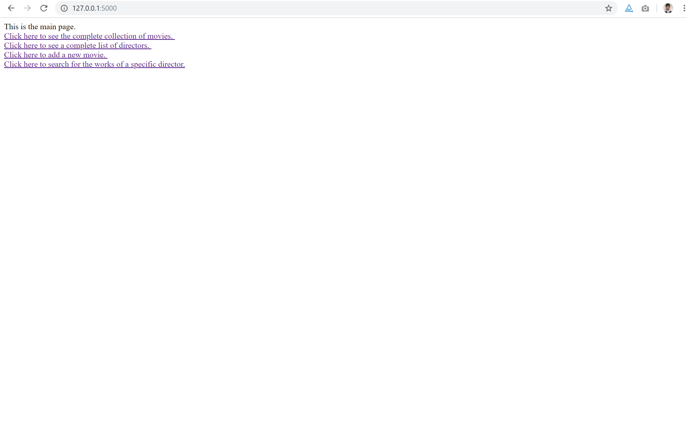
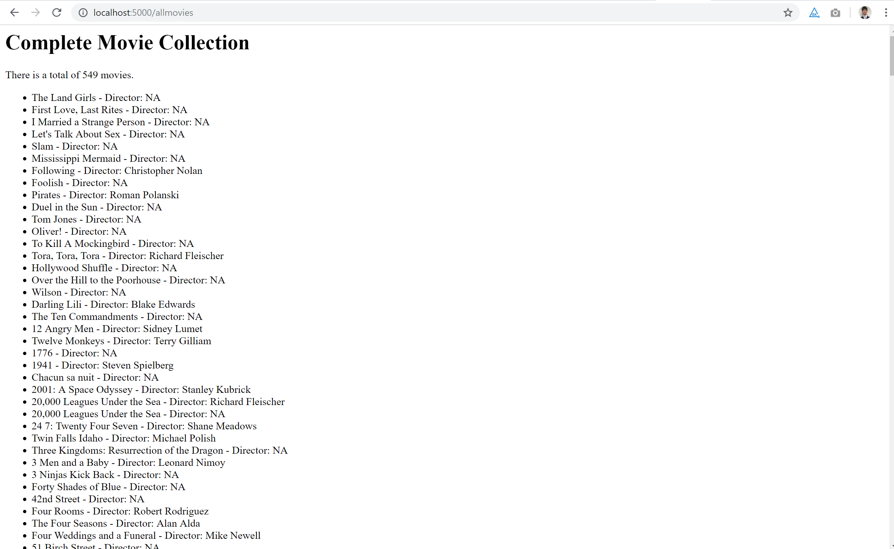

# SI 507 Final Project - Refined Movie Data Application

Benjamin Tse-Bung Yu

[Link to this repository](https://github.com/Bezluin/SI507_final_project)

---

## Project Description

This project is a Flask application that allows users to manipulate and retrieve data for movies. The application sources its data both from a pre-existing CSV file and also from
user input.  
Using the application, users can view information regarding movies such as the movie name, its director, and its rating. Users may also add new movie data to the existing database.  
The application can be run locally on any computer as long as all the files for the project are included and the requirements in the requirements.txt file are installed.

## How to run

1. First, you should install all requirements with `pip install -r reqiorements.txt`
2. Second, you should run `python final_project.py` in the terminal
3. The application should be running and hosted on ` http://127.0.0.1:5000/` now. **Note that due to the design of the application, on the initial run, it may take longer for the
landing page and some other pages to load (the program should be importing data from a CSV file and storing them into a database at this time)**

## How to use

1. Once the landing page finishes loading, the user should see this screen: 
2. The landing page includes links that lead to every route within the application. Clicking on any link brings users to the intended function as reflected in the link name.
3. This is an instance of what clicking on the `"Click here to see the complete collection of movies"` link should look like if arrived successfully at the link page: 

## Routes in this application
- Route 1: '/'   →   
  This page will display the landing page of the app, which displays all the links that users can use for different functions

- Route 2: '/allmovies'  →   
  This page displays a complete list of all the movies stored within the current database in addition to the total number of movies and the director for each movie.

- Route 3: '/alldirectors'  →   
  This page displays a complete list of all the directors stored within the database.

- Route 4: '/newmovie'  →
  This page displays a form, which allows users to input the title, director, and rating information for a new movie to be added to the database.

- Route 5: '/newmovie_result'  →  (linked to Route 4)
  This page displays some brief text showing the result of the added information from the form in Route 4.

- Route 6: '/director'  →  
  This page displays a form which allows users to enter a director name to search for the director's works.

- Route 7: '/director_results'  →  (linked to Route 6)
  This page displays the results retrieved from the input given in Route 6, showing all the movies directed by the specified director.

## How to run tests
1. First, arrive at the `SI507_final_project-master` directory
2. Second, run `python project_tests.py`

## In this repository:
- images/
  - landingpage.png
  - moviecollection.png
- static/
  - alert3.js
- templates/
  - addmovie.html
  - alldirectors.html
  - allmovies.html
  - searchdirector.html
- README.md
- database_diagram.png
- final_project.py
- movies_clean.csv
- project_tests.py
- requirements.txt
- sample_database.db
---
## Code Requirements for Grading
Please check the requirements you have accomplished in your code as demonstrated.
- [x] This is a completed requirement.
- [ ] This is an incomplete requirement.

Below is a list of the requirements listed in the rubric for you to copy and paste.  See rubric on Canvas for more details.

### General
- [x] Project is submitted as a Github repository
- [x] Project includes a working Flask application that runs locally on a computer
- [x] Project includes at least 1 test suite file with reasonable tests in it.
- [x] Includes a `requirements.txt` file containing all required modules to run program
- [x] Includes a clear and readable README.md that follows this template
- [x] Includes a sample .sqlite/.db file
- [x] Includes a diagram of your database schema
- [x] Includes EVERY file needed in order to run the project
- [x] Includes screenshots and/or clear descriptions of what your project should look like when it is working

### Flask Application
- [x] Includes at least 3 different routes
- [x] View/s a user can see when the application runs that are understandable/legible for someone who has NOT taken this course
- [x] Interactions with a database that has at least 2 tables
- [x] At least 1 relationship between 2 tables in database
- [x] Information stored in the database is viewed or interacted with in some way

### Additional Components (at least 6 required)
- [ ] Use of a new module
- [ ] Use of a second new module
- [ ] Object definitions using inheritance (indicate if this counts for 2 or 3 of the six requirements in a parenthetical)
- [ ] A many-to-many relationship in your database structure
- [x] At least one form in your Flask application
- [x] Templating in your Flask application
- [x] Inclusion of JavaScript files in the application
- [x] Links in the views of Flask application page/s
- [ ] Relevant use of `itertools` and/or `collections`
- [ ] Sourcing of data using web scraping
- [ ] Sourcing of data using web REST API requests
- [x] Sourcing of data using user input and/or a downloaded .csv or .json dataset
- [ ] Caching of data you continually retrieve from the internet in some way

### Submission
- [x] I included a link to my GitHub repository with the correct permissions on Canvas! (Did you though? Did you actually? Are you sure you didn't forget?)
- [x] I included a summary of my project and how I thought it went **in my Canvas submission**!
